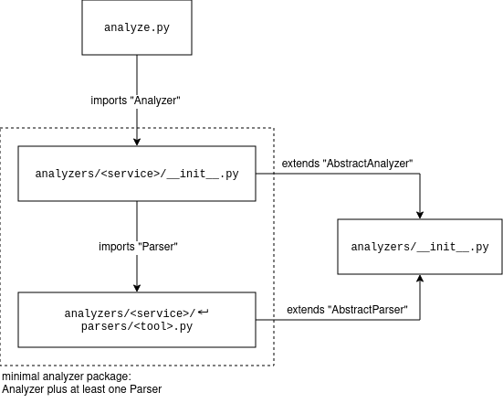

# architecture

The recon tool suite consists of two main components: the scanner (i.e. `scan.py`) and the analyzer (i.e. `analyze.py`).
The scanner schedules and runs various tools, based on the results of an Nmap service scan.
The analyzer, as its name implies, analyzes and summarizes the results of specific tools that the scanner previously run.

## scanner

The scanner component (i.e. `scan.py`) takes the result of an Nmap service scan as its input, and schedules and runs various tools, based on the services that were found on a particular host.

```text
PORT      STATE  SERVICE  VERSION
22/tcp    open   ssh      OpenSSH 6.6.1p1 Ubuntu 2ubuntu2.13 (Ubuntu Linux; protocol 2.0)
443/tcp   open   https    Apache httpd 2.4.7 ((Ubuntu))
```

In the example above, Nmap reported an SSH and HTTP service (with TLS) on the host.
So the scanner might run an Nmap script scan targeting SSH, and Nikto and `testssl.sh` targeting HTTP and TLS.

The selection of tools, and the parameters used for each, is specified in a [TOML](https://toml.io/en/) configuration file.
Below is an example configuration:

```toml
[globals]
username = 'user'
password = 'pa$Sw0rd'

[[services]]
name = 'http'
application_protocol = 'http'

[[services.scans]]
name = 'nikto'
transport_protocol = 'tcp'
command = """
  nikto \
  -ask no \
  -Cgidirs all \
  -host {hostname} \
  -port {port} \
  -nointeractive \
  -Format xml -output "{result_file}.xml" \
  2>&1 | tee "{result_file}.log" \
"""

[[services.scans]]
name = 'some-tool#authenticated'
command = 'some-tool -u "{username}" -p "{password}" ...'

[[services]]
name = 'ssh'
application_protocol = '^ssh'

[[services.scans]]
name = 'nmap'
command = """
  nmap \
  -Pn \
  -sV \
  -p {port} \
  --script="banner,ssh2-enum-algos,ssh-hostkey,ssh-auth-methods" \
  -oN "{result_file}.log" -oX "{result_file}.xml" \
  {address} \
"""

[[services]]
name = 'tls'
application_transport = '^ssl\||^tls\||https'

[[services.scans]]
name = 'testssl'
transport_protocol = 'tcp'
command = """
  testssl \
  --ip one \
  --nodns min \
  --mapping no-openssl \
  --warnings off \
  --connect-timeout 60 --openssl-timeout 60 \
  --logfile "{result_file}.log" --jsonfile "{result_file}.json" \
  {hostname}:{port} \
"""
```

Scans are grouped by services (i.e. `[[services]]`).
Each service group must have a name (e.g. `name = 'http'`) and should have a regular expression specifying which application protocols to match (i.e. `application_protocol`).
Additionally, the transport protocol can also be matched with a regular expression (i.e. `transport_protocol`).
A service group can have multiple scans (i.e. `[[services.scans]]`).

Each scan at least needs a name (i.e. `name = '...'`) and a command (i.e. `command = '...'`).
A scan can also have regular expressions for transport/application protocols to match against.
The scan name can contain tags (e.g. `some-tool#authenticated`).
The command can make use of the following variables (i.e. `{variable}`):

* all variables defined in the `[globals]` group
* `transport_protocol`: this is either `tcp` or `udp`
* `application_protocol`: as identified by Nmap (e.g. `https`, `ssh`)
* `address`: this holds the host's IP address
* `address_type`: this is either `IPv4`, `IPv6` or `hostname`
* `port`: this holds the port number the specific service uses
* `result_file`: this is the path (without file extension) to where the results are stored (i.e. `/path/to/project/recon/<address>/<service>[,<transport protocol>,<port>,...],<scan name>`)

In case the service was identified as a web service, the following additional variables are available:

* `scheme`: this is either `http` or `https`
* `hostname`: this holds either the host's DNS name or, as a fallback, its IP address

## analyzer

The analyzer (i.e. `analyze.py`) provides functionality to parse, analyze and summarize results of specific tools (e.g. `nmap`, `testssl`, `curl`, etc.).

Each service (e.g. HTTP, SSH, TLS, etc.) has its own analyzer "package" (e.g. [`analyzers/http/*`](../analyzers/http/), [`analyzers/ssh/*`](../analyzers/ssh/),  [`analyzers/tls/*`](../analyzers/tls/), etc.).
An analyzer package consists of an analyzer (i.e. `__init__.py`) and at least one parser (i.e. `<tool>.py`; one per tool).



A parser maps the result of a particular tool to a tool-agnostic representation of a service's configuration.
The representation schema is specified inside the analyzer (i.e. `SERVICE_SCHEMA = {...}`).
The compiled service configuration is analyzed (by the analyzer) based on some recommendations.
These recommendations are specified as TOML files (i.e. [`config/recommendations/<service>/*`](../config/recommendations/)).
TOML (or, more generally, a markup language) was chosen because it ensures that the recommendations are human-readable and therefore easier to maintain than code.

Based on a service's configuration (e.g. `'protocol_versions': ["TLS 1", ...],`) and the recommendations, the analyzer derives issues/vulnerabilities.
The issue descriptions (e.g. "protocol supported: TLS 1.0"), recommendations (e.g. "disable support for TLS 1.0") and links to references are stored in a TOML file (i.e. [`config/issues/<service>/<language>.toml`](../config/issues/)).
This allows easy translation of the information.
